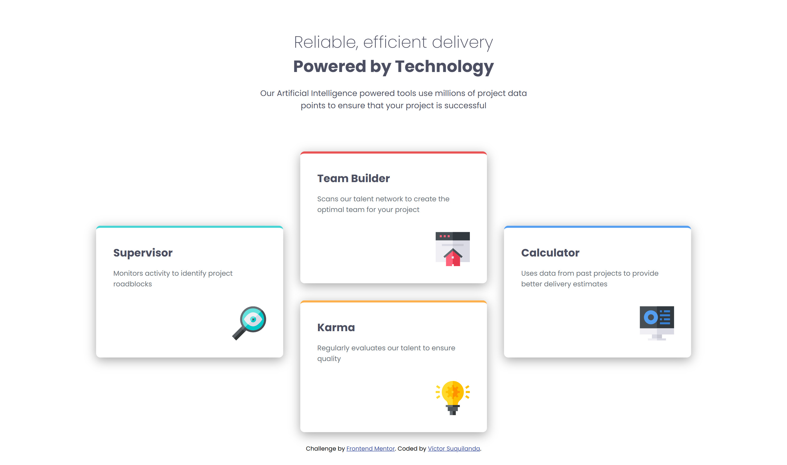

# Frontend Mentor - Four card feature section solution

This is a solution to the [Four card feature section challenge on Frontend Mentor](https://www.frontendmentor.io/challenges/four-card-feature-section-weK1eFYK). Frontend Mentor challenges help you improve your coding skills by building realistic projects. 

## Table of contents

- [Overview](#overview)
  - [The challenge](#the-challenge)
  - [Screenshot](#screenshot)
  - [Links](#links)
- [My process](#my-process)
  - [Built with](#built-with)
  - [What I learned](#what-i-learned)
  - [Continued development](#continued-development)
  - [Useful resources](#useful-resources)
  - [AI Collaboration](#ai-collaboration)
- [Author](#author)

## Overview

### The challenge

Users should be able to:

- View the optimal layout for the site depending on their device's screen size

### Screenshot



### Links

- Solution URL: [Add solution URL here](https://your-solution-url.com)
- Live Site URL: [Add live site URL here](https://your-live-site-url.com)

## My process

### Built with

- Semantic HTML5 markup
- BEM naming convention
- CSS custom properties
- CSS media queries
- Flexbox
- CSS Grid
- Mobile-first workflow

### What I learned

Among the key things I learned while working on this project were the use of fluid fonts and the implementation of Grid Areas:

1. **Responsive fonts using `clamp()`:** This function allows me to adjust the font size between a minimum and maximum value. This saves me from having to implement media queries solely for the purpose of resizing fonts. Additionally, the way the fonts scale looks much more natural.

    ```css
    :root {
      --font-main-title-size: clamp(1.5rem, 1rem + 1vw, 2.25rem);
    }

    .features__title {
        font-size: var(--font-main-title-size);
    }
    ```

2. **Grid Areas:** I wasn't familiar with the concept of Grid Areas, but it turned out to be the right approach for solving this challenge. The ability to define cell layouts using names was easier to implement than using grid lines.  

    ```css
    /* Example of use */
    .features__section--cards {
        display: grid;

        @media (min-width: 48em) {
          grid-template-columns: repeat(4, 1fr);
          grid-template-rows: repeat(3, 1fr);
          grid-template-areas: 
          '. team-builder team-builder .'
          'supervisor supervisor karma karma'
          '. calculator calculator .';
        }
    }

    .features__card--supervisor {
        @media (min-width: 48em) {grid-area: supervisor;}
    }

    .features__card--team-builder {
        @media (min-width: 48em) {grid-area: team-builder;}
    }

    .features__card--karma {
        @media (min-width: 48em) {grid-area: karma;}
    }

    .features__card--calculator {
        @media (min-width: 48em) {grid-area: calculator;}
    }

    ```

### Continued development

Among the concepts I would like to reinforce for future projects are:
- The use of viewport units; I haven’t quite mastered all their variations yet.
- The use of `clamp()` as a method for defining fluid fonts.
- The use of Grid Layout and related concepts.
- User accessibility when structuring HTML.

### Useful resources

- [Josh Comeau's Guide to Flexbox](https://www.joshwcomeau.com/css/interactive-guide-to-flexbox/) - This article helped me brush up on some basic Flexbox concepts that I had forgotten.
- [Josh Comeau's Guide to Grid](https://www.joshwcomeau.com/css/interactive-guide-to-grid/) - This article helped me understand and apply new concepts in Grid Layout. For example, Grid Areas, which I ended up using to complete this challenge.
- [`<a>`: The Anchor element (MDN article)](https://developer.mozilla.org/en-US/docs/Web/HTML/Reference/Elements/a) - This fairly comprehensive article from MDN helped me gain a deeper understanding of the attributes available for the “a” element and how they can be used to enhance the security and privacy of the webpage and the user.
- [Referer header (MDN article)](https://developer.mozilla.org/en-US/docs/Web/HTTP/Reference/Headers/Referer) - This article helped me gain a deeper understanding of the Referer header and its role in the exchange of information between HTTP requests.
- [HTML attribute: rel (MDN article)](https://developer.mozilla.org/en-US/docs/Web/HTML/Reference/Attributes/rel) - This article helped me gain a deeper understanding of the `rel` attribute and the various values we can assign to it to enhance the security of the page.

### AI Collaboration

For this solution, I used ChatGPT as a guide to clarify existing concepts and understand new ones. However, none of the code in this solution was generated by an AI tool.

## Author

- **Name** - Víctor Suquilanda
- **Frontend Mentor** - [@victor-sc12](https://www.frontendmentor.io/profile/victor-sc12)
- **GitHub** - [@victor-sc12](https://github.com/victor-sc12)
